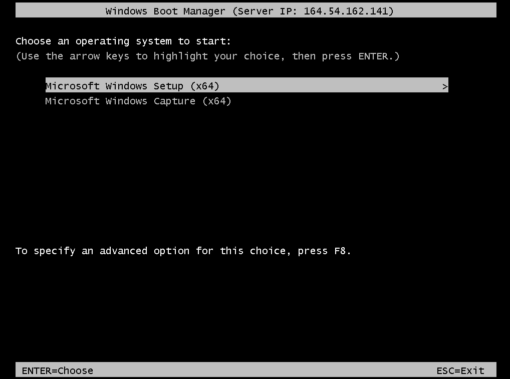

# Windows 10 Installation Guide

This file includes the basic instructions for a clean Windows 10 installation and AD Domain join.

------------
## Table of Contents

- [Installing Windows 10](#Installing%20Windows%2010)
    - [Requirements](#requirements)
    - [Boot into the Windows Installer](#boot%20into%20the%20windows%20installer)
    - [Installation Process](#installation%20process)
- [AD DS](#ad%20ds)
    - [Basic Configuration](#basic%20configuration)
    - [AD Domain Join](#ad%20domain%20join)
- [License](#license)

------------
## Installing Windows 10

### Requirements

Prior to installation, network boot (required for WDS installations) and UEFI mode must be enabled. Boot into BIOS and ensure that is the case for both. Most of the new workstations are using UEFI mode by default, but network boot is usually disabled for non-server workstations.

### Boot into the Windows Installer

In order to boot into the Windows 10 installer, a thumb drive with windows installer or network boot using WDS must be used.

To use **WDS** there are a couple of additional steps that need to be followed:

- Boot from the network and select "Microsoft Windows Setup (x64)".
  
  

- Connect to WDS using a domain account.
  
  

- Select to use the latest Windows 10 Enterprise version available.
  
  

### Installation Process

Installing Windows 10 includes selecting/partitioning the drive. Please use extra caution here, since data might be lost otherwise.

- You need to determine which disk the OS will be installed on, in our case the only available "Drive 0". All existing  partitions for this drive (Drive 0) must be deleted.  ⚡ **DELETING a partition will permanently delete ALL data! Only do so if you are 100% sure the partition/disk contains no relevant data.** ⚡

    

- Once all the partitions for the selected Drive 0 are deleted you will see "Drive 0 Unallocated Space" followed by the full size of the drive. Select the drive and click the next button.

  

The installation process will now automatically start. The system will restart a couple of times during the installation. Please make sure not to interrupt this process, since this might corrupt the windows installation.

[back to top](#table%20of%20contents)

------------
## AD DS

### Basic Configuration

After a successful installation there is some basic configuration that needs to be done before the system is ready for software installation.

- First, sign in using the local Administrator account.

    

- Next step is to install all Windows Updates. Be sure to click, "View optional updates" and install driver updates. This may require multiple reboots to complete. Keep checking for updates until you see the message "You are up to date".

### AD Domain Join

Once the system is fully updated we can proceed with AD Domain join.

- First, assign the computer a name. Go to Settings -> System -> About, and click "Rename this PC". After assigning make sure to reboot the system, before moving to the next step. GSECARS uses car (automobile) names. BioCARS has their own naming scheme, so check with them to see what name they would like. ChemMatCARS uses the naming scheme chemmat###, where ### is the last section of the IP address. For example, chemmat99 is the assigned name for the system with an IP of 164.54.16.99.
  
  

- Next, join the computer to the CARS domain. Go to Settings -> System -> About and click "Rename this PC (advanced)". There you have to click change to open the "Computer Name/Domain Changes" window. In this window you have to select the domain and type the CARS domain name (CARS.APS.ANL.GOV).
  
  

- When prompted, enter you CARS credentials. Once this is done make sure to reboot when prompted.
  
  

- After rebooting sign in again with the local administrator account in order to set up account access. Search and open the "Computer Management" window. There navigate to "Local Users and Groups", open the Groups folder and double click Administrators to open the local administrators group properties. Click add account, type "Domain users" in the box and click "Check Name". Select "Domain Users", click ok and apply. Now you should see "Administrator", "Domain Admins" and "Domain Users", meaning that "Domain Users" have now local admin right on the PC.

    

[back to top](#table%20of%20contents)

------------
## License

CARS-obsidian is distributed under the MIT license. You should have received a [copy](LICENSE) of the MIT License along with this program. If not, see https://mit-license.org/ for additional details.

[back to top](#table%20of%20contents)